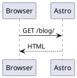

# PlantUML rendering

The blog renders fenced `plantuml` code blocks to SVG during Markdown and MDX compilation. The implementation is in [`src/markdown/plantuml.mjs`](../src/markdown/plantuml.mjs) and is registered as a Sätteri MDAST plugin in [`astro.config.mjs`](../astro.config.mjs).

## Authoring

Use a fenced block and provide useful alternative text in the fence metadata:

````md

````

The plugin adds `@startuml` and `@enduml` if no `@start...` marker is present. Explicit markers are preferred when the source also needs to work in editors and other PlantUML tools.

## Build environment

The devcontainer installs a headless Java runtime and Graphviz. It downloads the official PlantUML JAR at the version pinned by `PLANTUML_VERSION` in [`.devcontainer/Dockerfile`](../.devcontainer/Dockerfile), then verifies `PLANTUML_SHA256` before installing it at `/opt/plantuml/plantuml.jar`.

`PLANTUML_JAR` can point to another JAR for a focused local test:

```sh
PLANTUML_JAR=/path/to/plantuml.jar just build
```

After changing the pinned PlantUML version or the container packages, rebuild the devcontainer:

```sh
just up
```

## Pipeline

For every PlantUML code node, the plugin:

1. Runs `java -jar "$PLANTUML_JAR" --svg --pipe --charset UTF-8 --disable-metadata` without a shell.
2. Uses the content file's directory as the child process working directory so relative `!include` paths resolve beside the post.
3. Rejects process failures, non-SVG output, and output larger than 10 MiB.
4. Base64-encodes the SVG as a `data:image/svg+xml` image in a `.plantuml-diagram` figure.
5. Copies the `alt` fence metadata to the image and marks the figure with `data-pagefind-ignore`.

A data image keeps each SVG in its own document. This avoids ID collisions when a page contains several PlantUML diagrams and prevents generated SVG markup from sharing the article DOM.

The rendering plugin is asynchronous. Keep it in `mdastPlugins`; moving it to the HAST phase would run after syntax highlighting has already turned the source into an ordinary code block.

## Styling

PlantUML figure styles live in [`src/styles/global.css`](../src/styles/global.css). The wrapper uses a white background in both site themes because PlantUML's default palette assumes a light canvas. Authors can select another PlantUML theme inside the diagram source.

## Validation

The published demonstration in [`src/content/posts/render-plantuml-diagrams-in-astro.mdx`](../src/content/posts/render-plantuml-diagrams-in-astro.mdx) makes the production build exercise the renderer. Run:

```sh
just check
just check-links
```

A missing Java runtime or JAR causes the build to fail with a `Could not start PlantUML` message. A PlantUML syntax failure includes the renderer's stderr output.
