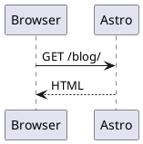

# PlantUML rendering

The blog renders fenced `plantuml` code blocks to inline SVG during Markdown and MDX compilation. The implementation is in [`src/markdown/plantuml.mjs`](../src/markdown/plantuml.mjs) and is registered as paired Sätteri MDAST and HAST plugins in [`astro.config.mjs`](../astro.config.mjs).

## Authoring

Use a fenced block and provide useful alternative text in the fence metadata:

````md

````

The plugin adds `@startuml` and `@enduml` if no `@start...` marker is present. Explicit markers are preferred when the source also needs to work in editors and other PlantUML tools.

## Build environment

The devcontainer installs a headless Java runtime and Graphviz. It downloads the official PlantUML JAR at the version pinned by `PLANTUML_VERSION` in [`.devcontainer/Dockerfile`](../.devcontainer/Dockerfile), then verifies `PLANTUML_SHA256` before installing it at `/opt/plantuml/plantuml.jar`.

`PLANTUML_JAR` can point to another JAR for a focused local test:

```sh
PLANTUML_JAR=/path/to/plantuml.jar just build
```

After changing the pinned PlantUML version or the container packages, rebuild the devcontainer:

```sh
just up
```

## Pipeline

For every PlantUML code node, the plugins:

1. Import [`src/markdown/plantuml-theme.iuml`](../src/markdown/plantuml-theme.iuml) with its light palette after the diagram's `@start...` line.
2. Run `java -jar "$PLANTUML_JAR" --svg --pipe --charset UTF-8 --disable-metadata` once without a shell.
3. Use the content file's directory as the child process working directory so relative `!include` paths resolve beside the post.
4. Reject process failures, non-SVG output, and output larger than 10 MiB.
5. Preserve the result in a figure placeholder until the HAST pass.
6. Parse and sanitize the SVG, prefix generated IDs and their references, and replace the site palette's fixed colors with inherited CSS variables.
7. Add an accessible title from the fence's `alt` metadata and mark the figure with `data-pagefind-ignore`.

The asynchronous renderer must remain in `mdastPlugins`; moving it to the HAST phase would run after syntax highlighting has turned the source into an ordinary code block. The paired `plantUMLHastPlugin` performs the safe inline insertion after the MDAST-to-HAST conversion.

## Styling

No built-in PlantUML theme is selected. Without site styling or an explicit `!theme`, PlantUML uses its default palette. The example previously selected `!theme plain`, which is PlantUML's black-on-white theme.

The renderer imports [`src/markdown/plantuml-theme.iuml`](../src/markdown/plantuml-theme.iuml) automatically. It uses PlantUML's CSS-like `<style>` syntax and includes legacy `skinparam` rules for diagram types that do not use the newer style system consistently.

PlantUML needs concrete colors while laying out the diagram, so the renderer uses the light palette as tokens. Before inserting the SVG, it replaces those colors with the corresponding variables from [`src/styles/global.css`](../src/styles/global.css). Because inline SVG inherits CSS variables from the page, one diagram follows both the initial theme and the theme toggle without client-side diagram code.

The site theme is inserted immediately after `@start...`, so later PlantUML directives in a fenced block can override it. Colors introduced by an explicit `!theme` remain fixed unless they use the site's token palette.

## Inline SVG safety

Inline SVG makes labels selectable and links interactive, but removes the security and CSS boundary provided by an `img`. The HAST plugin strips active elements, event-handler attributes, unsafe URLs, and styles containing external URLs or executable CSS. It also prefixes every generated ID using the content file, source location, and diagram source, then rewrites local references such as marker URLs.

PlantUML's embedded `<style>` elements are removed to prevent rules from leaking into the article. Safe presentation attributes and inline styles remain. The root receives `role="img"`, an `aria-labelledby` reference, and a generated `<title>` containing the authored alternative text.

## Validation

The demonstration in [`src/content/posts/examples/render-plantuml-diagrams-in-astro.mdx`](../src/content/posts/examples/render-plantuml-diagrams-in-astro.mdx) exercises the renderer in development. Run:

```sh
just check
just check-links
```

A missing Java runtime or JAR causes the build to fail with a `Could not start PlantUML` message. A PlantUML syntax failure includes the renderer's stderr output.
