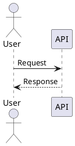

PlantUML is useful in Markdown because the diagram source remains readable in a
diff. I wanted the published result to remain vector graphics, without a browser
runtime or a call to a public rendering service.

This diagram was generated by the same Markdown plugin described below:

```plantuml alt="Sequence diagram of Astro sending diagram source to the local PlantUML process and receiving SVG"
@startuml
!theme plain
actor Author
participant "Astro build" as Astro
participant "Sätteri plugin" as Plugin
participant "PlantUML JAR" as PlantUML

Author -> Astro: Build MDX post
Astro -> Plugin: Visit plantuml fence
Plugin -> PlantUML: Source on stdin
PlantUML --> Plugin: SVG on stdout
Plugin --> Astro: SVG data image
Astro --> Author: Static HTML
@enduml
```

There is a community
[`astro-plantuml`](https://www.npmjs.com/package/astro-plantuml) integration in
Astro's integration directory, but it sends diagrams to a PlantUML server and
embeds PNG responses. This site uses a custom Sätteri Markdown processor as
well, so I used a small Sätteri plugin and the official
[PlantUML](https://github.com/plantuml/plantuml) JAR instead.

## Author a diagram in Markdown

A fenced block with the `plantuml` language is enough:

````md

````

The `alt` fence metadata becomes the image's alternative text. It defaults to
"PlantUML diagram", but a real description is better for any diagram that
conveys information.

The plugin adds `@startuml` and `@enduml` when they are omitted. Keeping them in
the source is still useful because editors and PlantUML command-line tools can
open the block without knowing about this site's shortcut. Other PlantUML forms,
such as mind maps and Gantt charts, keep their own `@start...` markers.

## Pin the official renderer

PlantUML needs Java, and several diagram layouts use Graphviz. Both are
installed in the devcontainer. The container also downloads a specific PlantUML
release and verifies its SHA-256 digest:

```dockerfile
ARG PLANTUML_VERSION=1.2026.6
ARG PLANTUML_SHA256=89948f14c93756c7a3fb7b69078ff37e8489fd79dd430c582b931e2f65358690

RUN apt-get install -y --no-install-recommends \
      default-jre-headless \
      graphviz \
  && curl -fsSL \
      "https://github.com/plantuml/plantuml/releases/download/v${PLANTUML_VERSION}/plantuml.jar" \
      -o /opt/plantuml/plantuml.jar \
  && echo "${PLANTUML_SHA256}  /opt/plantuml/plantuml.jar" | sha256sum -c -

ENV PLANTUML_JAR=/opt/plantuml/plantuml.jar
```

Pinning the JAR keeps layout changes from appearing unexpectedly after a clean
container build. It also makes the build independent of the availability and
rate limits of `plantuml.com` after the image has been created.

## Render from the Sätteri plugin

The plugin visits only code nodes whose language is `plantuml`. It starts Java
without a shell and pipes one completed diagram to PlantUML:

```js
const child = spawn(
  "java",
  [
    "-Djava.awt.headless=true",
    "-jar",
    process.env.PLANTUML_JAR,
    "--svg",
    "--pipe",
    "--charset",
    "UTF-8",
    "--disable-metadata",
  ],
  { cwd: documentDirectory, stdio: ["pipe", "pipe", "pipe"] },
);

child.stdin.end(source, "utf8");
```

Using the post's directory as the working directory allows a diagram to include
a nearby PlantUML file with a relative path. The plugin rejects failed
processes, non-SVG output, and SVGs larger than 10 MiB. A malformed diagram
therefore stops the build instead of quietly publishing an error image.

The complete implementation is in `src/markdown/plantuml.mjs`. It is registered
next to the other Sätteri MDAST plugins in `astro.config.mjs`:

```js
mdastPlugins: [directivePlugin, displayMathPlugin, plantUMLPlugin];
```

The visitor is asynchronous, so Astro waits for the Java process before it
finishes compiling the post.

## Keep each SVG isolated

PlantUML's SVG output can contain IDs for arrows, elements, and markers. Pasting
several generated SVGs directly into one document risks duplicate IDs. Instead,
the plugin base64-encodes each SVG into an image URL:

```html
<figure class="plantuml-diagram" data-pagefind-ignore>
  
</figure>
```

The browser still renders vector geometry at the final display size, but the SVG
has its own document boundary. The generated diagram source is also excluded
from Pagefind, which keeps labels from appearing as disconnected search text.

PlantUML's default diagrams use a light background, so the wrapper remains white
in both site themes. A post can select a different built-in PlantUML theme with
`!theme` when it needs another palette.

No client JavaScript is involved. By the time the static site reaches Nginx, the
diagram is an ordinary SVG-backed image inside the generated HTML.
